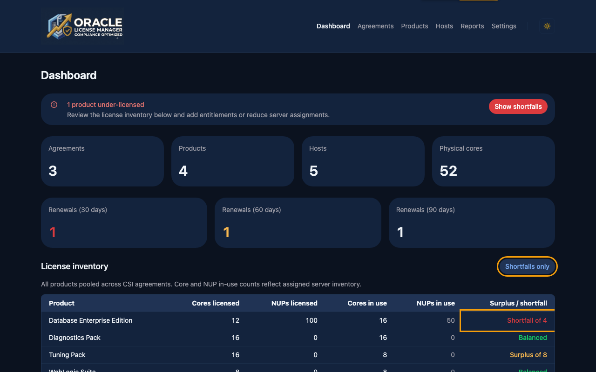
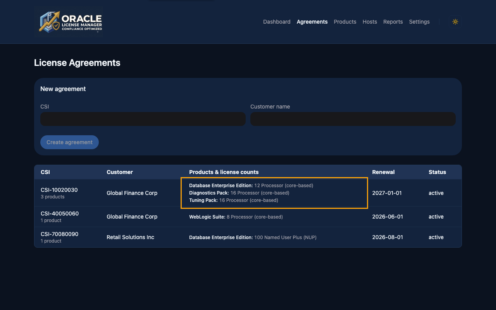
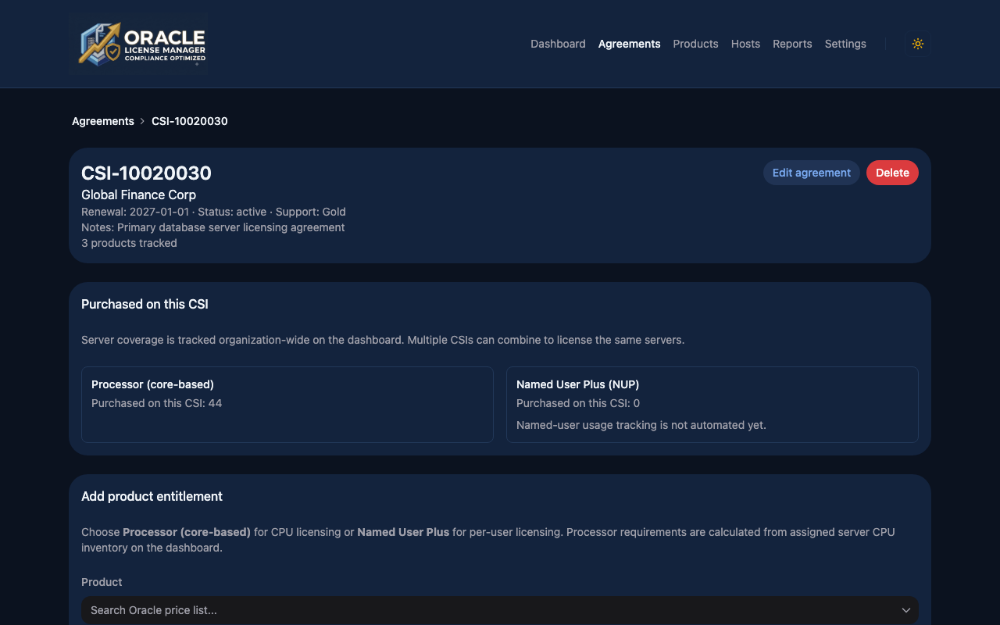
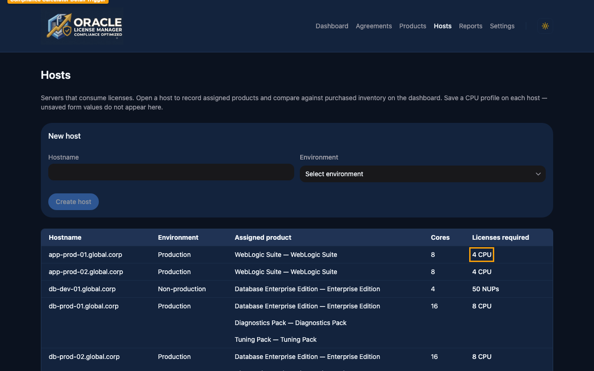
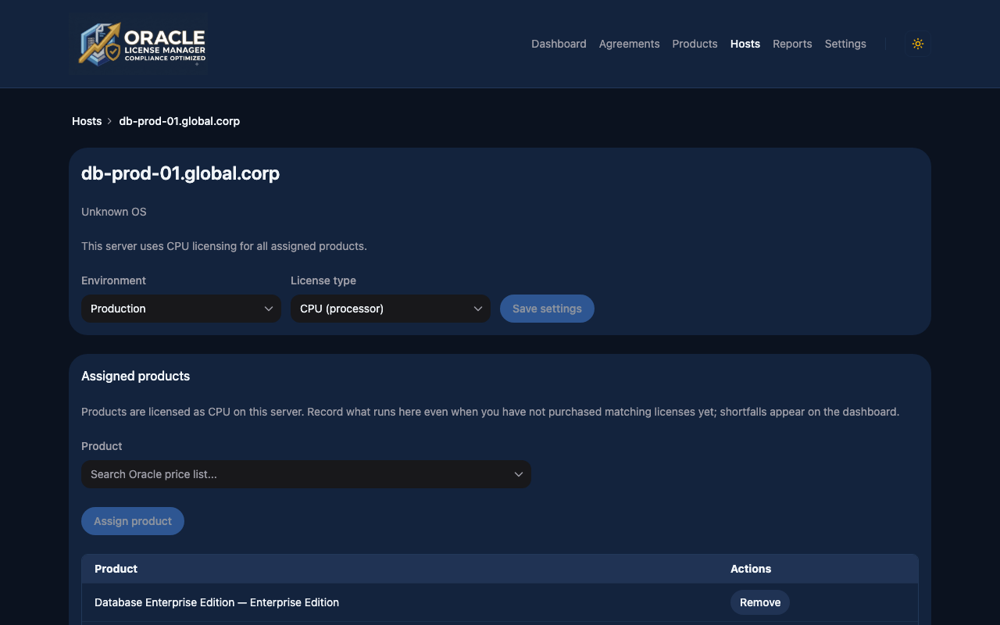
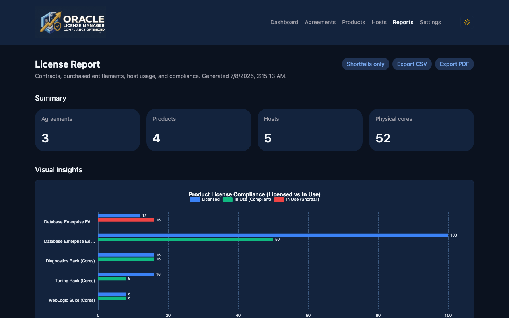

# User Guide

This guide explains how to use the Oracle License Tracker to manage your Oracle agreements, product entitlements, server CPU hardware inventory, and calculate real-time compliance.

---

## 1. Dashboard Overview

The **Dashboard** serves as the central control room for your license compliance posture. It pools all product entitlements across CSI agreements and compares them against assigned host CPU inventory in real-time.

### Key Features Highlighted above:

1. **Compliance Warning Alert (Amber Highlight)**: 
   When any Oracle product is under-licensed (shortfall), a global alert banner appears at the top of the dashboard specifying the number of under-licensed products. This alerts you immediately to compliance exposure.
   
2. **Filter Control (Amber Highlight)**: 
   Clicking the **Shortfalls only** button filters the license inventory list to display only products with a negative balance, helping administrators focus on remediation tasks.
   
3. **Shortfall / Surplus Balance (Amber Highlight)**: 
   The rightmost column of the inventory table displays the calculated balance:
   - **Shortfall of X**: The server inventory consumes more licenses than purchased.
   - **Surplus of X**: Excess licenses are available for deployment.
   - **Balanced**: Server usage matches purchased entitlements exactly.

---

## 2. Managing Agreements

An **Agreement** represents an Oracle purchase contract, identified by its Customer Support Identifier (CSI). 

### Agreements Listing

Navigate to `/agreements` to view all agreements, their status, customer details, and renewal timelines.

- **New CSI Contract Creation (Amber Highlight)**: Use this form card to register a new contract. Input the CSI number and the customer name, then click **Create agreement**.
- **Entitlements List (Wrapped) (Amber Highlight)**: The entitlements list shows all products, quantities, and metrics associated with each CSI agreement. 
  > [!NOTE]
  > Entitlements are displayed in a clean, vertical list formatting inside the table cell to prevent text overflow and maximize readability.

---

### Agreement Details & Entitlements

Clicking on a CSI number opens its detail page. Here, you can update agreement dates, status, or manage product entitlements.

- **CSI Metadata & Status (Amber Highlight)**: Displays the contract profile, including active support level, validity period, renewal dates, and notes.
- **Add Product Entitlement Form (Amber Highlight)**: Add purchased Oracle products to this contract. As you type, the search field queries the pre-loaded Oracle global technology price list catalog, helping auto-fill product options and matching prices.
- **Entitlements Database (Amber Highlight)**: Shows all added product entitlements under this contract. You can edit quantities or delete records.

---

## 3. Server Inventory & CPU Profiling

The **Hosts** page contains your inventory of physical servers or host partitions. 

### Hosts Inventory

Navigate to `/hosts` to see all servers and their calculated license usage.

- **New Host Server Creation (Amber Highlight)**: Register a physical node or partition. Select the environment (Production / Non-production) to help determine licensing compliance.
- **Compliance Calculator Detail Trigger (Amber Highlight)**: Clicking the required license quantity (e.g. `8 CPU`) triggers an interactive modal detailing the exact mathematical calculation used to compute that requirement.

---

### Host Details & CPU Profiling

Click a hostname to configure its CPU settings and assign products.

- **Host CPU Core Inventory (Amber Highlight)**: Set the physical CPU specifications. When you input the CPU model (e.g. `Intel Xeon`), the tracker queries the seed Core Factor table matching standard Oracle processor rules (e.g. core factor of `0.5`). 
  - *Core Factor Override*: You can check the override box to manually set a core factor if your hardware architecture requires custom rules.
- **Product Entitlements Pool Assignment (Amber Highlight)**: Assign one or more Oracle products running on this host from the drop-down. 

### License Calculation Rules

The tracker automatically computes licenses required based on metric type:

- **CPU (Processor Metric)**:
  $$\text{Licenses Required} = \lceil \text{Physical Cores} \times \text{Core Factor} \rceil$$
  *(Rounded up to the nearest whole integer)*
  
- **NUP (Named User Plus)**:
  $$\text{Licenses Required} = \text{Licensable Cores} \times 25 \text{ users}$$
  *(Subject to standard Oracle NUP minimums)*

---

## 4. Reports & Exports

The **Reports** page allows compliance auditing, visual tracking, and exporting of the compliance dataset.

- **Compliance Export Controls (Amber Highlight)**: Export the complete active inventory and host configuration dataset.
  - **Export CSV**: Download a spreadsheet format of the active dataset.
  - **Export PDF**: Generates a professional PDF report.
  
  > [!TIP]
  > The exported PDF report includes automatic line wrapping and column alignment to ensure multi-line lists (like assigned products or CSI entitlements) do not overflow, keeping the documentation clean and presentable.

- **Visual Insights**: A horizontal compliance bar chart comparing **Licenses Licensed** vs. **Licenses in Use** across all products is displayed dynamically on the reports page. This same chart is dynamically rendered on the server side and embedded directly within the exported PDF report under the "Visual insights" section.
